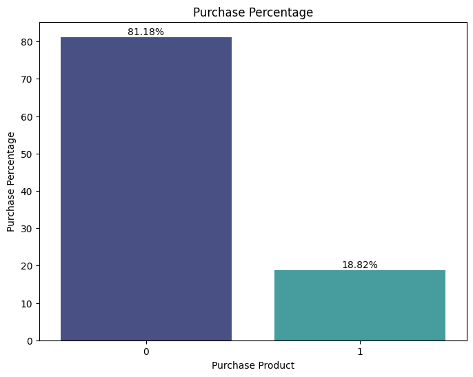
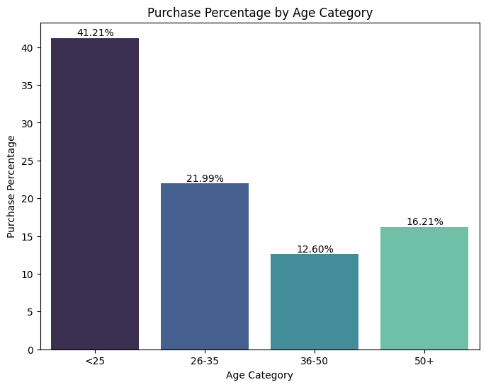
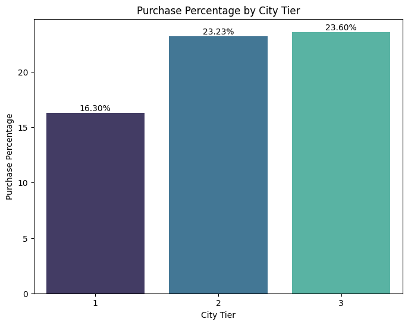
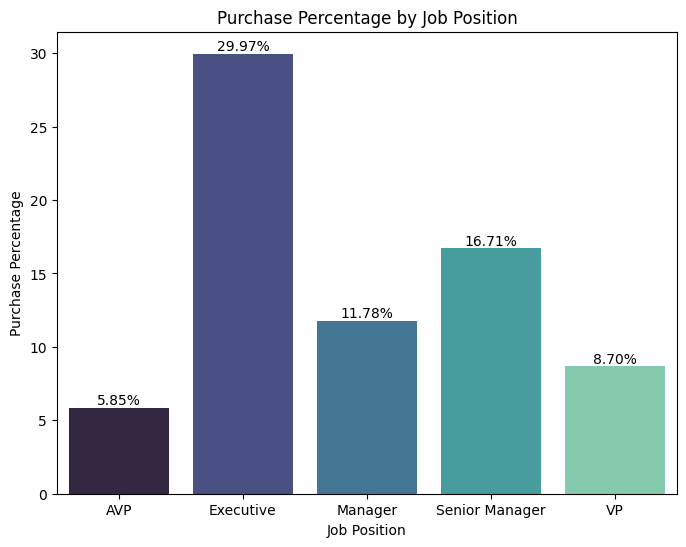
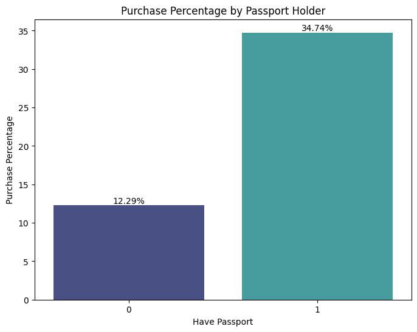
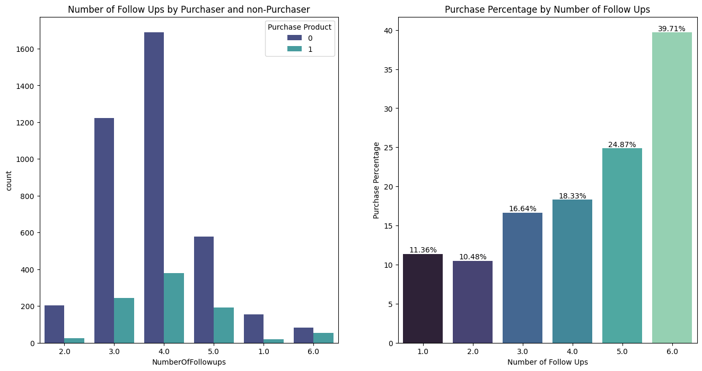
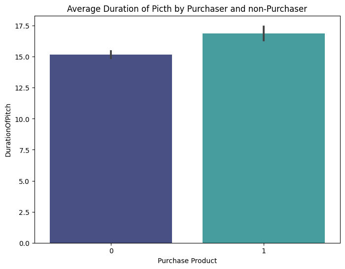
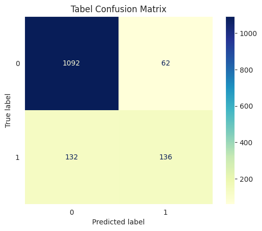

# Potential Customer Prediction
The travel industry is one of the largest service industries in the world. However, only a small part of the customer pool is willing to buy travel packages offered by travel companies. In order to predict potential customers so that we can target the right ones and increase the conversion rate, we will build several models to meet these goals. In this study, various models are constructed using classification algorithms to estimate potential customers in a sales dataset, and the results are compared. By using the results of this comparison, it is hoped that more detailed and effective data analysis can be carried out. The selected model will also be used to estimate customer acquisition costs.

---

## Prerequisites
1. Download dataset [here](https://www.kaggle.com/datasets/susant4learning/holiday-package-purchase-prediction?select=Travel.csv)
2. Install packages with `pip install requirements.txt`

## Table of Content
1. [Introduction](#Introduction)
2. [Business Insights](#Business-Insights)
3. [Data Preprocessing](#Data-Preprocessing)
4. [Feature Engineering](#Feature-Engineering)
5. [Modeling](#Modeling)
6. [Business Recommendation](#Business-Recommendation)

---

## Introduction
### Data Team of Chikitrans
We are an internal data team at a travel agent company called Chikitrans that sells travel packages.\
We, together with the marketing team, are responsible for providing business recommendations based on available data from the marketing team to improve the company's sales performance.

* **Tony Hermawan Widjanarko** as Project Leader & Data Scientist
* **Esraminar Siregar** as Data Scientist
* **Rayhan Prawira Daksa** as Data Scientist
* **Ryan Anugrah** as Business Analyst
* **Farhan Rizki** as Business Analyst
* **Rianita** as Data Analyst

### Industry Analysis
Based on [**2023 Global Travel Trends Report**](https://www.americanexpress.com/en-us/travel/discover/get-inspired/Global-Travel-Trends)
* 85% of respondents say they plan to take two or more leisure trips in 2023
* 78% of respondents agree they see leisure travel as an important budget priority
* 74% of respondents agree that they care more about creating a travel experience that meets their expectations than about the cost

Here we can say that the travel industry still has huge market potential.

### Current Situation
However, based on our sales data, we found that only **18.82%** of the total customers purchased the travel packages that we offered.



We decided to create a classification model from our sales data so that we can use the model as a predictive model to predict which customers will purchase the travel packages we offer to increase the conversion rate and also to reduce customer acquisition costs.\
The metrics for our objectives are as follows:
1. Conversion Rate
2. Customer Acquisition Cost

### Data Overview
The data contains 4888 rows of customer records with descriptions for each column as follows:
1. `CustomerID`: Unique customer ID
2. `ProdTaken`: A binary indicator (0 or 1) that shows whether the customer has purchased a holiday package (1) or not (0).
3. `Age`: The age of the customer.
4. `TypeofContact`: The type of contact used to contact the customer ('Company Invited' or 'Self Inquiry').
5. `CityTier`: The level of the customer's city of residence (referring to the level of development or city status)(Value; 1-3).
6. `DurationOfPitch`: Presentation duration in minutes when offering vacation packages to customers.
7. `Occupation`: Customer occupation ('Salaried', 'Small Business', or 'Large Business').
8. `Gender`: Customer's gender (Male and Female).
9. `NumberOfPersonVisiting`: The number of people who will visit (related to the number of family members or business associates who will join the holiday trip).
10. `NumberOfFollowups`: The number of follow-ups that have been done with customers.
11. `ProductPitched`: Products offered to customers.(Basic, Deluxe, Standard, Super Deluxe, King)
12. `PreferredPropertyStar`: The property star level desired by the customer.(3-5 stars)
13. `Marital Status`: The customer's marital status.(Single, Married, Divorce, Unmaried)
14. `NumberOfTrips`: Number of trips that have been made by previous customers.
15. `Passport`: A binary indicator (0 or 1) that shows whether the customer has a passport (1) or not (0).
16. `PitchSatisfactionScore`: Score of customer satisfaction on offer presentation.(Value;1-5)
17. `OwnCar`: A binary indicator (0 or 1) that shows whether the customer owns a car (1) or not (0).
18. `NumberOfChildrenVisiting`: Number of children who took part in the holiday trip.
19. `Designation`: Customer job title or position. (Executive, Manager, Senior Manager, AVP, VP)
20. `MonthlyIncome`: The customer's monthly income.


## Business Insights

When viewed from the purchase ratio of each age category, it can be seen that customers who are less than 25 years old have the highest purchasing power.



We can also see the higher the city tier, the higher the purchasing power of customers.



From the job position, customers who work as executives have the highest percentage of purchases.



It can be seen here that there is a significant difference in the percentage of purchases between passport holders and non-passport holders where passport holders have more purchasing power.



Now, if we break down sales by the number of follow-ups received by customers, it can be seen that the total follow-up of fewer than 6 times has a much higher total of customers who did not buy than customers who were followed up 6 times with the highest conversion rate of 39.71%.



While the average pitching duration of customers who purchased packages is only slightly higher than the average pitching duration of customers who did not buy.



## Data Preprocessing

### Handling Invalid Value
We have handled invalid values in the `Gender` and `MaritalStatus` columns because we found 
1. There is a typo in the `Gender` column where 'Fe male' should be 'Female'
2. There is a different use of terms for 'Unmarried' and 'Single' where both statuses are the same
```
df['Gender'] = df['Gender'].replace({'Fe Male': 'Female'})
df['MaritalStatus'] = df['MaritalStatus'].replace({'Unmarried': 'Single'})
```

### Handling Missing Value
We used mice imputation in handling missing values in `Age`, `DurationOfPitch`, `NumberOfFollowups`, `PreferredPropertyStar`, `NumberOfTrips`, `NumberOfChildrenVisiting`, and `MonthlyIncome` columns and mode imputation in the `TypeofContact` column.

```
col_to_impute = ['Age','DurationOfPitch','NumberOfFollowups','PreferredPropertyStar','NumberOfTrips','NumberOfChildrenVisiting','MonthlyIncome']
imputer = IterativeImputer(random_state=100, max_iter=10)
df[col_to_impute] = imputer.fit_transform(df[col_to_impute])
num_cols = ['Age','DurationOfPitch','NumberOfTrips','MonthlyIncome']
df['NumberOfTrips'] = df['NumberOfTrips'].round()
cat_float_cols = [col for col in df.columns if df[col].dtype == np.float64 and col not in num_cols]
for col in cat_float_cols:
  df[col] = df[col].round().astype(object)

df['TypeofContact'].fillna(df['TypeofContact'].mode()[0], inplace=True)
```

### Handling Duplicates
We dropped duplicates regardless of the `CustomerID` column.
```
df.drop('CustomerID', axis=1, inplace=True)
df.drop_duplicates(inplace=True)
```

### Handling Outlier
Due to the small dataset, we used the Z-Score method to deal with outliers in `DurationOfPitch`, `NumberOfTrips`, and `MonthlyIncome` columns.
```
filtered_entries = np.array([True] * len(df))
skewed_cols = ['DurationOfPitch', 'NumberOfTrips', 'MonthlyIncome']
for col in skewed_cols:
    zscore = abs(stats.zscore(df[col]))
    filtered_entries = (zscore < 3) & filtered_entries
df = df[filtered_entries]
```
As a result, there are 4737 data rows in our clean dataset.

## Feature Engineering
Here, we processed all features in the dataset before modeling.

### Feature Extraction
We created a new column called `TotalVisiting` by combining the values in the `NumberOfPersonVisiting` and `NumberOfChildrenVisting` columns.
```
df['TotalVisiting'] = df['NumberOfPersonVisiting'] + df['NumberOfChildrenVisiting']
```

### Feature Transformation
Based on the preprocessing data, there are several numerical features that are not normally distributed or have a positive skew. So we do log transformation or standardizing so that the distribution is normal/close to normal.
```
df['log_MonthlyIncome']=np.log(df['MonthlyIncome'])
df['stand_Age']=StandardScaler().fit_transform(df['Age'].values.reshape(len(df), 1))
df['log_DurationOfPitch']=np.log(df['DurationOfPitch'])
```

### Feature Encoding
We used `LabelEncoder` for ordinal columns and `OneHotEncoder` for nominal columns.
```
encoder=LabelEncoder()
df.Occupation=encoder.fit_transform(df.Occupation)
df.Designation=encoder.fit_transform(df.Designation)
df.ProductPitched=encoder.fit_transform(df.ProductPitched)

encoder = OneHotEncoder()
columns_to_encode = ['Gender', 'TypeofContact', 'MaritalStatus']
ct = ColumnTransformer([('encoder', encoder, columns_to_encode)], remainder='passthrough')
encoded_data = ct.fit_transform(df)
encoded_df = pd.DataFrame(encoded_data)
ct.named_transformers_['encoder'].get_feature_names_out(columns_to_encode)
new_columns = list(encoded_columns) + list(df.columns.drop(columns_to_encode))
encoded_df.columns = new_columns
df = encoded_df
```

### Feature Selection
Since we want to predict which customers will buy the packages we offer, we use the `ProdTaken` column as the target in our model. For the features, we used ANOVA to see the importance of each feature. After looking at the ANOVA results, we decided to include all the columns as a feature because there is nothing large
gap between each other in terms of interests. However, we omit some of the columns which are `DurationOfPitch`,
`NumberOfFollowups`, `ProductPitched`, and `PitchSatisfactionScore` to reflect our business process i.e. if we want to use this model as a potential customer prediction model, we would not have data for these four columns yet because we used the model before pitching the customer. Therefore, we can declare 
* Target: `ProdTaken` column
* Features: All columns except `ProdTaken`, `DurationOfPitch`, `NumberOfFollowups`, `ProductPitched`, and `PitchSatisfactionScore` columns
  
```
X = df.drop(['ProdTaken', 'log_DurationOfPitch', 'NumberOfFollowups', 'ProductPitched', 'PitchSatisfactionScore'], axis=1, inplace=False)
y = df['ProdTaken'].values
```

### Train-Test Split
We use a 70:30 ratio to divide the training and test datasets.

```
X_train, X_test, y_train, y_test = train_test_split(X, y, test_size=0.30, random_state=42, stratify=y)
```

* The training dataset consists of 3315 rows
* The test dataset consists of 1422 rows

### Handling Imbalance
Oversampling needs to be done because there is an imbalance in the target column. Oversampling will be done using the `SMOTE` method.

```
X_over_SMOTE, y_over_SMOTE = over_sampling.SMOTE(random_state=40).fit_resample(X_train, y_train)
X_train = X_over_SMOTE
y_train = y_over_SMOTE
```
After oversampling using SMOTE, the data is ready to be used for modeling.

## Modeling
At the modeling stage, we will compare several methods and later we will choose which model produces the best performance. The model with the best performance that we will choose in a later stage. Five models we used are as follows:
```
rfc = RandomForestClassifier(random_state=33)
etc = ExtraTreesClassifier(random_state=33)
gbc = GradientBoostingClassifier(random_state=33)
bgc = BaggingClassifier(random_state=33)
xgb = XGBClassifier(eval_metric='error',random_state=33)
```

### Fit and Evaluation
We fit and transform the models on the training and test datasets which aims to see the model scores when the data is being trained and tested and see the differences.

| Model | Training Accuracy	| Test Accuracy	| Precision Score | Recall Score | F1 Score	| ROC_AUC (train-proba)	| ROC_AUC (test-proba) |
|---|:----:|:----:|:----:|:----:|:----:|:----:|:----:|
|XGBClassifier|	99.76|	86.36|	68.69|	50.75|	58.37|	100.00|	85.72|
|BaggingClassifier|	99.67|	85.94|	67.53|	48.88|	56.71|	99.99|	86.05|
|RandomForestClassifier|	100.00|	87.13|	75.15|	47.39|	58.12|	100.00|	86.76|
|ExtraTreesClassifier|	100.00|	87.06|	75.00|	47.01|	57.80|	100.00|	87.49|
|GradientBoostingClassifier|	90.95|	83.26|	57.08|	45.15|	50.42|	96.79|	79.12|	

As we can see, the accuracy for all models is over 80. In this case, in addition to the accuracy value we calculate, we will also consider the precision value because we prefer our model to have the greatest possible accuracy in predicting potential customers.

The Total Positive (TP) in this case is the total customer who is predicted to buy the package and actually buys the package, while the False Positive (FP) in this case is the customer who is predicted to buy the package, but doesn't actually buy the package. Since the number of potential customers is the total number of customers who are predicted to buy, namely TP+FP, and the customers who are predicted to buy and actually buy are TP, the value of TP/(TP+FP) or the precision value is chosen as the best evaluation indicator for the model.

It can be seen that the Random Forest and Extra Trees models have the highest precision values. However, because the accuracy value reached 100% and there were indications of overfitting, we chose the XG Boost model as the model that had the best evaluation results. The recall value of the XG Boost model also supports our choice as we either don't want to ignore customers who were not predicted to buy when they actually buy or in other words, we want to get as few False Negative (FN) cases as possible.

Here is the confusion matrix of prediction results on the test dataset.


## Business Recommendation
Based on Exploratory Data Analysis, we can provide the following recommendations:
1. Provide passport registration services to help potential customers if they still don't hold a passport
2. If we want to focus our marketing on certain demographics, we may consider these criteria to create a customer pool before we use the model to predict which customers will and will not buy. The criteria are as follows:
    * Age less than 25 years
    * Live in tier 2 & 3 cities
    * Working as an executive
4. Blast email notifications to notify  potential customers about new promotions or special packages
5. Prioritizing follow-up to potential customers (up to 6x follow-up) over non-potential customers (1x follow-up) to boost
marketing budget efficiency

We've stated that we selected Conversion Rate and Customer Acquisition Cost as metrics for our objectives. The following is a simulation of metric improvements if we use the model.

### Conversion Rate Simulation
#### Before Model
<table>
    <tr>
        <th>All Customers</th>
        <td>1,422</td>
    </tr>
    <tr>
        <th>Conversion Rate</th>
        <td>18.82%</td>
    </tr>
</table>

#### After Model
<table>
    <tr><td></td>
        <th>Customer</th>
    </tr>
    <tr>
        <th>True Positive</th>
        <td>136</td>
    </tr>
    <tr>
        <th>False Positive</th>
        <td>62</td>
    </tr>
    <tr>
        <th>True Negative</th>
        <td>1,092</td>
    </tr>
    <tr>
        <th>False Negative</th>
        <td>132</td>
    </tr>
    <tr>
        <th>Conversion Rate</th>
        <td>68.69%</td>
    </tr>
</table>

If we only want to pitch to customers who are expected to buy the packages we offer. We will get a conversion rate of True Positive Customers / (True Positive Customers + False Positive Customers) which is 68.69%. Here, we can see that by using the model we can increase the conversion rate.

### Cost Efficiency Simulation
From the data, we can see the average number of follow up for all customers is 4. From EDA, we already know that customers who were followed up 6 times have the highest conversion rate. We also want to give a chance to customers who are not predicted to buy as we hope that they will actually buy. So, we are going to do a simulation with these rules:
* Cost per Follow Up = IDR 10,000
* Customers who are not predicted to purchase will be followed up once.
* Customers who are predicted to purchase will be followed up to 6 times.

#### Before Model
<table>
    <tr>
        <th></th>
        <th>Customer</th>
        <th>Number of Follow Up</th>
        <th>Cost (IDR)</th>
    </tr>
    <tr>
        <th>All Customers</th>
        <td>1,422</td>
        <td>4</td>
        <td>56,880,000</td>
    </tr>
    <tr>
        <th colspan="3">Total</th>
        <td>56,880,000</td>
    </tr>
</table>

#### After Model
<table>
    <tr>
        <th></th>
        <th>Customer</th>
        <th>Number of Follow Up</th>
        <th>Cost (IDR)</th>
    </tr>
    <tr>
        <th>True Positive</th>
        <td>136</td>
        <td>6</td>
        <td>8,160,000</td>
    </tr>
    <tr>
        <th>False Positive</th>
        <td>62</td>
        <td>6</td>
        <td>3,720,000</td>
    </tr>
    <tr>
        <th>True Negative</th>
        <td>1,092</td>
        <td>1</td>
        <td>10,920,000</td>
    </tr>
    <tr>
        <th>False Negative</th>
        <td>132</td>
        <td>1</td>
        <td>1,320,000</td>
    </tr>
    <tr>
        <th colspan="3">Total</th>
        <td>24,120,000</td>
    </tr>
</table>

As we can see, there is a difference in customer acquisition costs of IDR 32,760,000 to achieve the same conversion rate if we use the model. If we used the remaining marketing budget to reach more customers, we could add up to 1,931 to our customer pool.

<table>
    <tr>
        <th></th>
        <th>Total Follow Up</th>
        <th>Total Customer</th>
        <th>Marketing Budget (IDR)</th>
        <th>Cost (IDR)</th>
        <th>Marketing Budget Balance (IDR)</th>
        <th>Customer Acquisition Cost</th>
        <th>Additional Customer Pool</th>
    </tr>
    <tr>
        <th>Before Model</th>
        <td>5,688</td>
        <td>1,422</td>
        <td>56,880,000</td>
        <td>56,880,000</td>
        <td>0</td>
        <td>40,000</td>
        <td>0</td>
    </tr>
    <tr>
        <th>After Model</th>
        <td>2,412</td>
        <td>1,422</td>
        <td>56,880,000</td>
        <td>24,120,000</td>
        <td>32,760,000</td>
        <td>16,962</td>
        <td>1,931</td>
    </tr>
</table>

From this simulation, we can see that by using the model we can reduce customer acquisition costs.
